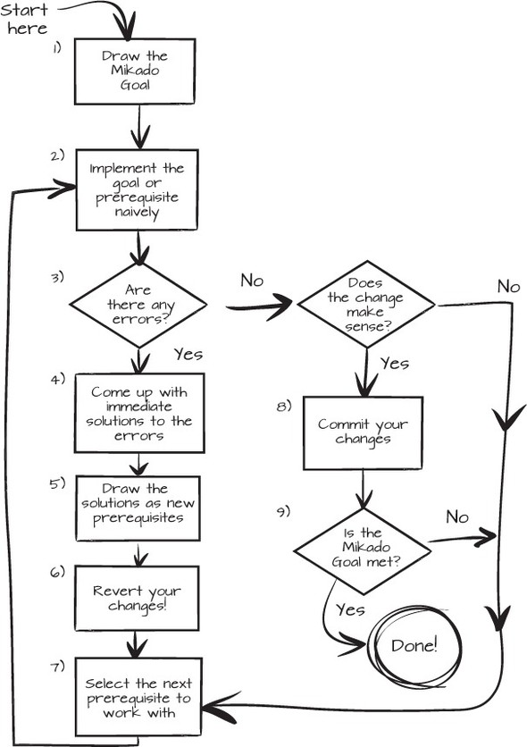

The main objective for this kata is to practice baby step refactoring while using the technique of the Mikado graph.

What is the Mikado method?
https://www.methodsandtools.com/archive/mikado.php

To sum up, the Mikado method helps you build a graph of your refactoring dependencies and execute them without ever breaking your codebase.
To build your Mikado graph, you need to:
- Set actionable goals.
- Experiment them, by changing your code implementing the goal in the most naive and straightforward way, to see which part of the system breaks.
This gives you the prerequisites needed before you can achieve the goal.
- Write down the goal and its prerequisites. You can break your goal into sub-goals.
- Undo your breaking changes.

You can do this process iteratively:

When your graph is finished, you can start your development from the leaves at the bottom to the main goals at the top.

The main benefits of the Mikado method:
- It lets you get an idea of how big the change is. A picture is worth a thousand words, and a Mikado Graph is worth more than a thousand to-dos.
- It helps you keep track of your work.
- It helps you communicate about your code. 
- You can then decide where to put the development focus.

Now, let's see how this method can help us refactor our code.
The goal is to prepare the code for the addition of a new discount type: "Two for one".
First, refactor the code of "Three for two", which is similar to "Two for one", using a Mikado graph.
Then, add the new discount type.

Your Mikado graph will look like this:

- [ ] 👍Prepare the code for an easy addition of "X for Y" discount type family
  - [ ] 👍Isolate the "Three for two" discount computation
      - [ ] ...
          - [ ] ...         
  - [ ] 👍Make the "computeThreeForTwoDiscount" function generic
      - [ ] ...
      - [ ] ...
- [ ] 👍Add a new offer "TWO_FOR_ONE"
    - [ ] ...
- [ ] Parking-Lot
    - [ ] ...

